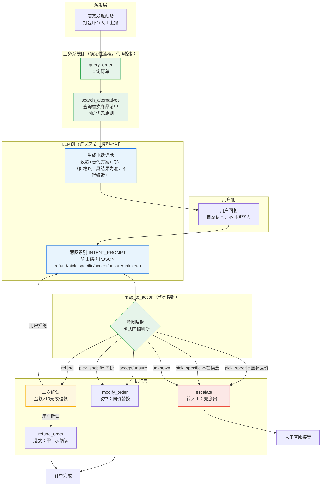

# 闪购缺货协商 Agent

> 闪购场景下，商家触发缺货事件时自动触发且致电用户进行协商替换商品或退款的Agent。
> 包含完整的测试流程：16条测试用例*3轮，意图识别率为100%（关键字版为75%）。

## 为什么做这个场景

真实经历：我和我朋友都经历过在闪购平台上下单后，商家打电话来协商替换缺货的商品的经历。我确认这是一个由事件触发、需要多伦交互且天然需要人工兜底的真实业务场景。

## 架构与取舍



**核心设计原则：确定性归代码，语义归模型。**

- 业务流程（查单 → 推荐 → 执行）由代码固定编排；LLM 只嵌在两个语义环节——生成话术、理解用户回复。
- **为什么不用全自主 Agent**：业务流程是确定的，确定性流程用固定编排，成本和延迟可控、可预测、失败好兜底；LLM 只处理流程中唯一不确定的环节——自然语言。
- **为什么意图识别不用关键字匹配**（评测驱动的架构修正，见下）：自然语言包含否定语义（"别退款"）、词表外实体（"换方便面"）、口语形态（"换 酸奶 吧"），关键字分类器在这三类输入上系统性失败。

## 防御设计清单

| 机制 | 防什么 | 实现位置 |
|---|---|---|
| LLM 调用双层重试 | 网络/服务抖动 | ChatDeepSeek 参数 + llm_call 手动 3 次 |
| 转人工兜底 | LLM 连续失败时业务不中断 | 重试耗尽 → SystemMessage 通知转人工 |
| 假工具名防御 | 模型幻觉调用不存在的函数 | tool_node 校验 tools_by_name |
| 意图识别降级 | JSON 解析失败 | 异常捕获 → unknown → 转人工 |
| 防死循环 | Agent 无限自循环 | recursion_limit=15 + max_rounds=3 |
| 二次确认 | 用户资产操作风险 | 退款必确认；换货金额≥10元需确认 |
| 价格事实约束 | 模型编造价格 | SystemMessage 明令"价格以工具结果为准" |

## 评测体系

**用例集**：16 条用户回复，覆盖七类——明确同意（指定/未指定商品）、明确拒绝、模糊、情绪化、否定词陷阱、答非所问、输入形态异常。

**评测结果（架构修正前后）**：

| 版本 | 通过 | 失败 | 通过率 |
|---|---|---|---|
| 关键字版 | 12 | 4 | 75% |
| LLM 版 | 16 | 0 | 100% |

**4 条失败的归因结论**：全部收敛于同一架构错配——**意图识别这个"模糊任务"被放在了确定性代码里**。修正：意图识别改为 LLM（INTENT_PROMPT + 结构化 JSON 输出 + 解析失败降级转人工），map_to_action 保留纯代码控制。

## 评测驱动的决策变更记录

| 用例 | 发现 | 决策变更 | 理由 |
|---|---|---|---|
| TC-09 "随便/你看着办" | 原策略转人工，但用户已把决定权交给 Agent 且 Agent 有合格方案 | 改为：Agent 替用户选推荐项 + 明确告知 | 错误成本（同价可回退）< 打扰成本（人工介入） |
| TC-05/06 被拒分支 | 用户拒绝退款后系统静默等待，无引导话术 | 补被拒分支对话流 | 控制流完整 ≠ 对话流完整 |
| TC-16 "换方便面" | 词表外商品被静默替换为推荐商品 | 增加"不在候选"分支：告知用户 | 静默替换用户指定商品 = 最危险的失败模式 |

## 已知局限与生产化方向

| 局限 | 生产化方向 |
|---|---|
| 无记忆模块（每次 invoke 新会话） | 接入 LangGraph checkpointer，多轮协商状态持久化 |
| mock 数据三处重复定义（工具返回/prompt/ALTERNATIVES） | 收敛为单一数据源，引用处动态生成 |
| 单订单硬编码（A1000） | 事件携带订单号，全链路参数化 |
| 评测为单轮手动执行 | 用例集脚本化 + CI 回归 |
| 查询链当前由LLM编排（ReAct） | 应固化为代码编排，无悬念步骤不消耗模型调用 |

## 如何运行

```bash
# 1. 安装依赖
pip install langchain langgraph langchain-deepseek python-dotenv

# 2. 配置密钥
cp .env.example .env
# 编辑 .env 填入 DEEPSEEK_API_KEY

# 3. 运行
python agent.py
```
